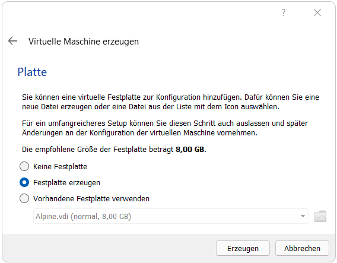

# **Virtualisierungsserver auf Basis von Alpine Linux**

In diesem Projekt wird ein Linux Server auf Basis von Alpine Linux aufgesetzt, welcher über das Netzwerkinterfaces des physischen Rechners angebunden wird (Netzwerkbrücke über VirtualBox). Alpine wird mit einer statischen IP-Adresse konfiguriert und erhält einen SSH-Server.
Im weiteren Verlauf wird beschrieben, wie eine Systemvirtualisierung mittels KVM als Hypervisor eingerichtet werden kann. Zur Veranschaulichung soll ein Debian System als Virtualisierungsmaschine verwendet werden, auf dem ebenfalls ein SSH-Server installiert wird. Nun kann sowohl auf Alpine als auch auf Debian ein SSH-Zugriff erfolgen. Beide Systeme sollen über die statische IP-Adresse von Alpine erreichbar sein.
Parallel zur VM sollen außerdem 2 Dockercontainer eingerichtet werden. Als Beispielcontainer werden Portainer, sowie nginx als Webserver installiert. Auch diese sollen über die Adresse des Hosts und den zugehörigen Ports erreichbar sein.

## **Inhaltsverzeichnis**

- [Installation von Alpine Linux in einer Virtualisierungssoftware](#installation-alpine)
  - [Downloads](#installation-downnloads)
  - [Erstellung der virtuellen Maschine](#installation-create)
  - [Einstellungen der virtuellen Maschine](#installation-settings)
- [Einrichtung von Alpine Linux](#setup)
  - [Alpine-Setup](#setup-alpine)
  - [Installation eines Texteditors](#setup-nano)
  - [Konfiguration einer statischen IP-Adresse](#setup-interfaces)
  - [Installation des SSH-Servers](#setup-ssh)
  - [Aktivierung der Community Repository](#setup-repos)
- [Systemvirtualisierung mit KVM, QEMU und Libvirt](#kvm)
  - [Installation](#kvm-installataion)
  - [Übersicht der Befehle](#kvm-commands)
  - [Erstellung einer Debian-VM](#kvm-debian)
  - [SSH-Zugriff auf Debian ermöglichen](#kvm-ssh)
- [Containervirtualisierung mit Docker](#docker)
  - [Installation](#docker-installation)
  - [Übersicht der Befehle](#docker-commands)
  - [Hello World Container](#docker-hello-world)
  - [Nginx als Container](#docker-nginx)
  - [Portainer als Container](#docker-portainer)
  - [Container mithilfe Docker Compose installieren](#docker-compose)


## **Installation von Alpine Linux in einer Virtualisierungssoftware**
<a name="installation-alpine"></a>

### **Downloads**
<a name="installation-downnloads"></a>

Als Virtualisierungssoftware wird [Oracle VM VirtualBox](https://www.virtualbox.org/) verwendet.  
  
Beim Download der Alpine Linux Version haben wir uns für [Standard x86_64](https://alpinelinux.org/downloads/) entschieden.
Die Version spielt später bei der Installation von QEMU eine Rolle.

### **Erstellen der virtuellen Maschine**
<a name="installation-create"></a>

Zunächst wird die Installation von Alpine über VirtualBox beschrieben. Dem System müssen virtuelle Hardwareelemente (Massenspeichergerät, Arbeitsspeicher, Netzwerkadapter, ...) zugewiesen werden.

<details><summary>Anleitung als Bilderreihe ausklappen</summary>
  
Zunächst muss in der Virtualisierungssoftware eine neue virtuelle Maschine erstellt werden. Dies wird über den Button "**neu**" gemacht.
  

  
Nun wird nach **Systemname** und **Installationsverzeichnis** gefragt, welche frei gewählt werden können. Bei **Typ** und **Version** sollen folgende Einstellungen gewählt werden:
  

  
Anschließend muss ausgewählt werden, wie viel Arbeitsspeicher dem System zur Verfügung stehen soll. Laut Systemanforderung von Alpine Linux sollen mindestens 100 Megabyte bereitgestellt werden. Somit sind 1 Gigabyte RAM mehr als ausreichend.
  

  
Nachfolgend soll ein Festspeichermedium für das System gewählt werden. Dabei erstellen wir ein von VirtualBox zur Verfügung stehendes virtuelles Laufwerk.
  

  
Als Dateityp wird hier die standardmäßige Auswahl "**vdi**" gewählt.
  

  
Um mögliche spätere Probleme zu vermeiden, wählen wir bei der Speicherart "**feste Größe**".
  

  
Im nächsten Fenster kann der Speicherort und die Speichergröße gewählt werden. 8 Gigabyte reichen bei diesem Projekt völlig aus.
  


</details>

### **Einstellungen der virtuellen Maschine**
<a name="installation-create"></a>
  
Nun müssen noch weitere Einstellungen erfolgen, um das System nutzen zu können.
  
<details><summary>Anleitung als Bilderreihe ausklappen</summary>
  
Um weitere Einstellungen vornehmen zu können, muss Alpine ausgewählt werden und auf die Schaltfläche "**Ändern**" gedrückt werden.
  

  
Im Bereich "**System**" sollte folgende Bootreihenfolge definiert werden:
  

  
Die ISO-Bootdatei kann im Bereich "**Massenspeicher**" ausgewählt werden.
  

  
Im Bereich "**Netzwerk**" wird die Einstellung "**Netzwerkbrücke**" verwendet und der verfügbare Netzwerkadapter ausgewählt. Bei diesem Hostsystem wird eine WLAN-Netzwerkkarte verwendet. Dadurch ist es dem Alpine System später möglich, selbstständig auf das WLAN-Netzwerk über eine eigene IP-Adresse zuzugreifen.
  


</details>

## **Einrichtung von Alpine Linux**
<a name="setup"></a>

### **Alpine-Setup**
<a name="setup-alpine"></a>
Die virtuelle Maschine Alpine kann anschließend gestartet werden.
Es erfolgt ein Login über den Benutzernamen `root`. Alternativ kann auch ein Benutzer erstellt werden, welchem anschließend die notwendigen Rechte zugewiesen werden. Wir verwenden im ganzen Projekt root, um das System ohne Einschränkungen konfigurieren zu können.

Zur Einrichtung stellt Alpine Linux ein eigenes Skript bereit, um diese möglichst stark zu vereinfachen.  
Dieses Setup kann mit folgendem Kommando gestartet werden:
```bash
setup-alpine
```
  
<details><summary>Genauere Installationsanleitung ausklappen</summary>

Bei der Tastatureinstellung wählt man in der Regel das **deutsche Layout** mit folgenden Antworten:
```bash
Select keyboard layout [none]: de
Select variant (or 'abort'): de
```
Der Hostname kann **frei gewählt** werden:
```bash
Enter system hostname (short form, e.g. 'foo') [localhost]: alpine
```
Im Folgenden wird nach den Network-Interface Einstellungen gefragt. Bei der IP-Adressenabfrage würde standardmäßig DHCP ausgewählt werden für eine automatische IP-Adressenzuweisung. In unserem Projekt soll dem Server jedoch eine statische IP-Adresse zugewiesen werden, weshalb hier **eine im Netzwerk verfügbare IP-Adresse** eingegeben wird. Falls im Setup-Skript diese manuelle Einstellung nicht gemacht wird, kann die Netzwerkkonfiguration auch im Nachhinein erfolgen. Zudem wird die passende Netzwerkmaske und der Gateway ausgewählt, die zum ordnungsgemäßen Verbindungsaufbau mit dem Router erforderlich sind:
```bash
Avaliable interfaces are: eth0
Enter '?' for help on bridges, bondig and vlans.
Which one do you want to initialize? (or '?' or 'done') [eth0] eth0

Ip adress for eth0? (or 'dhcp', 'none', '?') [dhcp] 192.168.2.100

Netmask? [255.255.255.0] 255.255.255.0

Gateway? (or 'none') [none] 192.168.2.1

Do you want to do any manual configuration? (y/n) [] n
```
Anschließend wird nach einem Namen für einen DNS-Server gefragt, dieser kann genauso wie der Hostname **frei gewählt** werden:
```bash
DNS domain name? (e.g 'bar.com') dns
```
Das Script frägt dann nach der DNS-Serveradresse. Wir verwenden [1.1.1.1](https://1.1.1.1/) von Cloudflare:
```bash
DNS nameserver(s)? 1.1.1.1
```
Nun muss ein root-Passwort vergeben werden:
```bash
Changing password for root
New password:
Retype password:
```
Nach einer Zeitzone wird auch noch gefragt:
```bash
Which timezone you are in? ('?' for list) [UTC] UTC
```
Es kann ein Proxy-Server konfiguriert werden, diesen lassen wir deaktiviert:
```bash
HTTP/FTP proxy URL? (e.g. 'http://proxy:8080', or 'none') none
```
Ein NTP-Client zur Zeitsynchronisierung kann ausgewählt werden:
```bash
Which NTP client to run? ('busybox', 'openntpd', 'chrony' or 'none') chrony
```
Anschließend kann noch ein Standard-Repository gewählt werden:
```bash
1) ...
...
58) ...

r)
f)
e)

Enter mirror number (1-57) or URL to add (or r/f/e/done) [1] 1
```
Als SSH-Server verwenden wir openssh, genauere Konfigurationseinstellungen werden später vorgenommen. Diese Auswahl ist wichtig, da wir einen SSH-Server für unser System einrichten wollen. Falls diese Einstellung übersehen wurde bzw. **none** eingegeben wurde, kann SSH im späteren Verlauf auch nachinstalliert werden.
```bash
Which SSH server? ('openssh', 'dropbear' or 'none') openssh
```
Als Nächstes kann eine Partition gewählt werden, auf der das System installiert werden soll. Hier verwenden wir den zuvor konfigurierten viruellen Massenspeicher: 
```bash
Avaliable disks are:
  sda    (8 GB ATA     VBOX HARDDISK     )
Which disk(s) would you like to use? (or '?' for help or 'none') [none] sda
```
Nun muss noch die Verwendungsart der Partition als Systempartition festgelegt werden:
```bash
Avaliable disks are:
  sda    (8 GB ATA     VBOX HARDDISK     )
How would you like to use it? ('sys', 'data', 'lvm' or '?' for help) [?] sys
```
Alpine Setup warnt uns vor dem Zurücksetzen und Schreiben der Partionion, diese Warnung kann aber mit ja bestätigt werden: 
```bash
WARNING: The following disk(s) will be erased:
  sda    (8 GB ATA     VBOX HARDDISK     )
WARNING: Erase the above disk(s) and continue? (y/n) [n] y
```
Die Installation ist somit abgeschlossen und das System kann nach einem Neustart verwendet werden:
```bash
Installation is complete. Please reboot.
reboot
```
</details>

### **Installation eines Texteditors**
<a name="setup-nano"></a>

Da im Weiteren Verlauf Konfigurationsdateien bearbeitet werden müssen, empfiehlt es sich einen Texteditor ihrer Wahl zu installieren.
Wir haben uns für nano entschieden.
Die Installation kann mit folgenden Befehl gestartet werden:
```bash
apk add nano
```

### **Konfiguration einer statischen IP-Adresse**
<a name="setup-interfaces"></a>
Falls im Alpine-Setup bereits eine statische-IP Adresse zugewiesen wurde, kann dieser Schritt übersprungen werden. Ansonsten beschreibt folgender Abschnitt die manuelle Einrichtung.
  
Zu Konfiguration einer statischen IP-Adresse muss die Datei `/etc/network/interfaces` bearbeitet werden.
Zur automatischen Änderung der Zeilen in dieser Datei kann ein Programm mit folgendem Befehl gestartet werden:
```bash
setup-interfaces
```
Alternativ kann die Datei auch mithilfe eines einfachen Texteditors verändert werden. Es erfolgt die Änderung der Ethernet-Schnittstelle von dhcp auf **static**, sowie die Angabe von IP-Adresse, Netzwerkmaske und Gateway. 
  
Anschließend kann die Konfigurationsdatei mit unserer Konfigurationsdatei [`interfaces`](config-files/interfaces) verglichen werden:
```bash
cat /etc/network/interfaces
```
_Quelle: [cyberciti.biz](https://www.cyberciti.biz/faq/how-to-configure-static-ip-address-on-alpine-linux/)_
### **Installation des SSH-Servers**
<a name="setup-ssh"></a>
Falls der OpenSSH-Server noch nicht mit dem Alpine Setup installiert wurde, kann dieser auch nachinstalliert werden:
```bash
apk add openssh
```
  
Um den SSH-Zugriff zu ermöglichen, muss nun die Konfigurationsdatei des SSH-Daemons bearbeitet werden:
```bash
nano /etc/ssh/sshd_config
```
Folgendes muss geändert werden:
- Auskommentieren der Zeile `Port 22`
  
Falls der SSH-Zugriff über root erfolgen soll, müssen noch folgende weitere Änderungen vorgenommen werden: 
- Auskommentieren der Zeile `PermitRootLogin prohibit-password`
- Ändern der Zeile `PermitRootLogin prohibit-password` in `PermitRootLogin yes`
  
Um Programme mit grafischer Oberfläche via SSH zu starten, muss X11-Forwarding aktiviert werden: 
-  Ändern der Zeile `X11Forwarding no` in `X11Forwarding yes`
  
Die Konfigurationsdatei kann anschließend mit unserer [`sshd_config`](config-files/sshd_config) verglichen werden.

_Quelle: [cyberciti.biz](https://www.cyberciti.biz/faq/how-to-install-openssh-server-on-alpine-linux-including-docker/)_

### **Aktivierung der Community Repository**
<a name="setup-repos"></a>

Seit der Alpine Version 3.3 sind Repositories von Alpine in die Kategorien Main, Community und Test aufgeteilt.
Um die Installation aller Programme zu ermöglichen muss mindestens ein Community Repository aktiviert werden.
Hierzu wird die Datei [`repositories`](config-files/repositories) bearbeitet.
```bash
nano /etc/apk/repositories
```
  
Anschließend muss ein `#` zur Auskommentierung bei mindestens einem Community Repository weggenommen werden. 

## **Systemvirtualisierung mit KVM, QEMU und Libvirt**
<a name="kvm"></a>

Bei KVM (Kernel-based Virtual Machine) handelt es sich um eine Virtualisierungstechnologie, welche im Kernelmodul von Linux ab Version 2.6.20 integriert ist. Damit steht es auch unserem Alpine System zur Verfügung. Neben der softwareseitigen Unterstützung ist zudem wichtig, dass der Prozessor des Rechners Systemvirtualisierung unterstützt, wobei dies besonders bei neueren Prozessoren der Fall sein wird. 

Zur Verwaltung bzw. Installation einer virtueller Maschine (VM) wird zusätzlich QEMU und Libvirt benötigt. Diese beiden Begriffe spielen eine wichtige Rolle in Verbindung mit KVM:

| Programm | Erklärung |
|:--|:--|
| QEMU | Wird verwendet, um virtuelle Hardware (Festplatte, Netzwerkkarte, usw.) zu simulieren. KVM nutzt also die Funktionen von QEMU, um die Hardware vollständig emulieren zu können. Beide laufen in Kombination, wobei KVM hauptsächlich für die Erhöhung der Performance verantwortlich ist. Dies liegt daran, dass mithilfe KVM keine virtuelle CPU emuliert wird. Stattdessen arbeitet es mit den Virtualisierungstechniken (Intel-VT und AMD-V) der Prozessoren (Hardwarevirtualisierung). |
| **Libvirt** | Stellt eine API bereit, welches eine erleichterte Verwaltung und Ansteuerung von virtuellen Maschinen ermöglicht. |

_Quelle: [goyalankit.com](https://goyalankit.com/blog/note-on-hypervisors)_
_Quelle: [packetcoders.io](https://www.packetcoders.io/what-is-the-difference-between-qemu-and-kvm/)_


Folgende 3 bekannte Programme benutzen die **Libvirt-Schnittstelle**, um virtuelle Maschinen ansteuern zu können. Zum besseren Verständnis werden diese im Folgenden erklärt: 

| Programm | Typ | Erklärung |
|:--|:--|:--|
| virsh | CLI | Erstellung und spätere Verwaltung (starten, stoppen, usw.) der VMs mithilfe Befehlen in der Kommandozeile möglich |
| virt-install | CLI | Ermöglicht die Erstellung einer VM in der Kommandozeile, dies erfolgt durch Eingabe eines einzigen Befehls, welcher mit geeigneten Parameter die notwendigen Informationen zum System erhält. |
| virt-manager| GUI | Alternative zu virt-install. Stellt eine grafische Benutzeroberfläche zur Erstellung von VMs bereit, ähnlich wie VirtualBox |

_Quelle: [octetz.com](https://octetz.com/docs/2020/2020-05-06-linux-hypervisor-setup/)_

### **Installation**
<a name="kvm-installataion"></a>

Um KVM innerhalb VirtualBox einrichten zu können, muss Nested Virtualisierung aktiviert werden.
  
`Virtuelle Maschine anklicken` -> `Ändern` -> `System` -> `Prozessor` -> `Nested VT-x/AMD-V aktivieren`
<details><summary>Bild ausklappen</summary>
  


</details>

Um zu prüfen, ob KVM auf Alpine funktioniert, hilft folgender Befehl:
```bash
lsmod | grep kvm
```
Taucht dann der Begriff `KVM` auf, so sollte KVM auf dem System verfügbar sein.
  
_Quelle: [wiki.ubuntuusers](https://wiki.ubuntuusers.de/KVM/)_


Durch folgende Befehle wird QEMU und Libvirt auf unserer x86-Maschine installiert, sowie der Libvirt-Daemon gestartet: 
```bash
apk add libvirt-daemon qemu-img qemu-system-x86_64 qemu-modules openrc
rc-update add libvirtd
```

Zudem werden die beiden Pakete `virt-install` und optional `virt-manager`, bei Verfügbarkeit einer grafischen Oberfläche, mit folgenden Befehlen installiert:
```bash
apk add virt-install
apk add virt-manager
```
  
Zur Erstellung einer VM muss zudem das Modul "TUN" nachgeladen bzw. aktiviert werden. Dieses simuliert ein Ende-zu-Ende-Netzwerkgerät und wird für die Erstellung von virtuellen Netzwerken benötigt.
```bash
modprobe tun
```
Das "TUN" Modul ist standardmäßig beim Systemstart deaktiviert. Um dies zu ändern, muss `tun` in der Datei [`/etc/modules`](config-files/modules) angefügt werden.

_Quelle: [wiki.alpinelinux.org](https://wiki.alpinelinux.org/wiki/KVM)_

### **Übersicht der Befehle**
<a name="kvm-commands"></a>

Im Folgenden erfolgt eine Übersicht von wichtigen Befehlen der oben genannten Programme zur Verwaltung von virtuellen Maschinen:
  
Das virt-install Programm mit den wichtigsten Optionen zum Erstellen einer neuen virtuellen Maschine:
```bash
virt-install [flags]
```
| Flag | Erklärung |
|:--|:--|
| --name | Name der Gast-Virtualisierung |
| --memory | Speicherplatz der allokiert werden soll, in MiB |
| --location  | Speicherort der ISO-Datei aus der die Maschine installiert werden soll (Lokaler ISO-Pfad oder HTTP-Directory) |
| --extra-args | Argumente für eine Extra Kernel Installation  |
| --os-variant | Optimiert die Konfiguration für ein Betriebssystem |
| --disk | Spezifiziert den Speicher einer virtuellen Maschine |
| --network | Verbindet den Host mit einem virtuellen Netzwerk |
| --graphics | Spezifiziert den Displaytyp und spezielle Displayeigenschaften |
| --console | Verbindet die Gast-Konsole mit einer Konsole vom Host |
| --boot | Spezifiziert die Boot-Eigenschaften nach der Installation (Reihenfolge, Geräte, etc.) |

_Quelle: [manpages.ubuntu.com](http://manpages.ubuntu.com/manpages/bionic/man1/virt-install.1.html)_
  
Der virsh-Command zum Verwalten der VM:
```bash
virsh [option]
```
| Option | Erklärung |
|:--|:--|
| list | Listet alle laufenden VMs auf |
| list --all | Listet alle verfügbaren VMs auf |
| edit `<name>` | Ändert Eigenschaften der VM |
| virsh start `<name>` | Startet eine VM |
| virsh shutdown `<name>` | Schaltet eine VM aus |
| virsh destroy `<name>` | Erzwingt das Herunterfahren einer VM |
| virsh autostart `<name>` | Startet eine VM beim Start des Hostsystems |
| virsh autostart --disable `<name>` | Entfernt die Autostart-Eigenschaft der VM |
| virsh undefine --nvram `<name>` | Löscht eine VM |


_Quelle: [manpages.ubuntu.com](http://manpages.ubuntu.com/manpages/xenial/man1/virsh.1.html)_


### **Erstellung einer Debian-VM**
<a name="kvm-debian"></a>

Eine virtuelles Debian kann mit folgendem Kommando durch das Programm virt-install erstellt werden:
```bash
virt-install --virt-type kvm --name debian \
--location http://deb.debian.org/debian/dists/buster/main/installer-amd64/ \
--os-variant debian10 \
--disk size=5 --memory 1000 \
--graphics none \
--console pty,target_type=serial \
--extra-args "console=ttyS0" \
--boot uefi
```

_Quelle: [wiki.debian.org](https://wiki.debian.org/KVM)_

Im Anschluss erfolgt die eigentliche Installation des Debian-Systems. Auf diese wird nicht näher eingegangen, da diese zum Großteil selbsterklärend ist und im weiteren Verlauf die getroffenen Einstellungen keine große Rolle spielen.
Zum Ende der Installation wird gefragt, ob der SSH-Dienst OpenSSH noch mitinstalliert werden soll. Dies kann an dieser Stelle direkt gemacht werden, um den SSH-Server einrichten zu können.

**OPTIONAL: Erstellung der VM mithilfe einer GUI und dem Programm virt-manager**
<details><summary>Installation ansehen</summary>

Zunächst wird eine grafische Benutzerfläche zum Starten der virt-manager Anwendung benötigt. 
Dazu bietet sich die Desktopumgebung XFCE an, welche mit folgenden Command installiert wird:
```bash
apk add xfce4 xfce4-terminal xfce4-screensaver lightdm-gtk-greeter dbus
```
Zudem sollten die Services dbus (Desktop-Bus zur Programmkommunikation) und udev (Geräteverwaltung) aktiviert und zum Systemstart hinzugefügt werden:
```bash
rc-service dbus start
rc-update add dbus
rc-update add udev
```
XFCE wird dann mithilfe ```startx``` gestartet und virt-manager kann geöffnet werden (da oben bereits installiert). Die folgende Bilderreihe zeigt die gemachten Installationsschritte. Es wurden die gleichen Einstellungen wie zuvor über virt-install ausgewählt.
_Quelle: [wiki.alpinelinux.org](https://wiki.alpinelinux.org/wiki/Xfce)_

<details><summary>Bilderreihe ausklappen</summary>


Durch Aktivieren der Checkbox können zudem manuell weitere Einstellungen getroffen werden, wie z.B. die Auswahl der Firmware. Außerdem kann bei "network selection" ein anderes virtuelles Netzwerk ausgewählt werden, wie z.B. eine zuvor erstellte Netzwerkbrücke. Wir belassen es jedoch beim Default-Netzwerk, welches über NAT der VM eine IP-Adresse zuweist.


Hier sieht man, dass noch weitere Einstellungen vorgenommen werden können, unter anderem das Hinzufügen weiterer Geräte, Änderungen am Netzwerk und vieles mehr. Die Firmware wurde vor der Installation auf das modernere UEFI gestellt.


Nach erfolgreicher Installation kann die Konsole von Debian in virt-manager aufgerufen werden. 

</details>

</details>

Um das installierte System verwalten zu können (ohne virt-manager), bietet virsh nützliche Befehle an:
```bash
virsh start debian # Zum Starten von Debian
virsh start debian --console # Debian im Vordergrund starten
virsh shutdown debian # Zum Herunterfahren von Debian
virsh autostart debian # Debian beim Systemstart
virsh console debian # Bei laufendem Debian mit dem Terminal verbinden
```
Debian wird in unserem Fall direkt beim Systemstart ausgeführt, damit später sofort ein SSH-Zugriff erfolgen kann.
### **SSH-Zugriff auf Debian ermöglichen**
<a name="kvm-ssh"></a>

Zum Bereitstellen des SSH-Services wird OpenSSH installiert (falls dies bei der Installation noch nicht erfolgte):
```bash
apt-get install openssh-server
```

Damit der SSH-Dienst auf Port 22 erreichbar ist, muss die Konfigurationsdatei [`sshd_config`](config-files/sshd_config) in Debian geändert werden:
```bash
nano /etc/ssh/sshd_config
```

Ebenso wie bei der Alpine Einrichtung, wird die Zeile `Port 22` auskommentiert, sowie `PermitRootLogin` auskommentiert und auf `yes` gestellt.
  
Anschließend kann die IP-Adresse (hier `192.168.122.146`) des Debian-Systems mit folgendem Befehl ermittelt werden:
```bash
ip addr
```
Diese wurde automatisch von der erstellten virtuellen Netzwerbrücke (virbr0) mithilfe NAT an die VM zugewiesen. virbr0 verbindet das Ethernet-Interface des Hosts mit der virtuellen Netzwerkkarte der VM (vnet0) und wurde bei der Installation von Libvirt erzeugt. 
Zunächst kann auf den SSH-Dienst nur innerhalb Alpine mit der zuvor ermittelten IP-Adresse zugegriffen werden:
```bash
ssh 192.168.122.146
```

Falls dies funktioniert hat, müssen nun Firewallregeln erstellt werden, um den Dienst von außen erreichbar zu machen. Hierbei benutzen wir eine Portweiterleitung von einem beliebigen Port aus (standardisierte Ports vermeiden), in diesem Fall `9876`. Dadurch kann ein SSH-Zugriff von außen über diesen Port erfolgen.
```bash
iptables -t nat -I PREROUTING -p tcp --dport 9876 -j DNAT --to 192.168.122.146:22
iptables -I FORWARD -o virbr0 -d 192.168.122.146 -j ACCEPT
```
Das Programm iptables ermöglicht uns die Einrichtung von Paketfiltern. 
Die erste Regel ermöglicht die Umleitung des externen Ports 9876 auf den internen Debian SSH-Server mit Port 22. Dazu wird die Tabelle nat (-t) ausgewählt, da eine Adressumsetzung erfolgt. Durch die Chain PREROUTING werden alle eingehenden TCP-Pakete mit Port 9876 auf die IP-Adresse 192.168.122.146 mit Port 22 umgeändert und danach weitergeleitet.
Die zweite Regel akzeptiert nun die Weiterleitung aller Pakete aus Regel 1, die an die virtuelle Netzwerkbrücke virbr0 und an die IP-Adresse der Debian-VM gesendet werden. Durch diese beiden Regeln kann somit eine Portweiterleitung auf die VM erfolgen.

_Quelle: [aboullaite.me](https://aboullaite.me/kvm-qemo-forward-ports-with-iptables/)_

_Quelle: [wiki.ubuntuusers.de](https://wiki.ubuntuusers.de/iptables/)_

Anschließend können wir wie gewohnt über unsere IP-Adresse des Alpine-Systems auf den SSH-Dienst von Debian zugreifen. Zu beachten ist hierbei, dass im SSH-Client der Port `9876` eingestellt wird.
Der SSH-Befehl in der Windows-Eingabeaufforderung würde für den Zugriff auf Debian folgendermaßen lauten: 
```bash
ssh root@192.168.178.100 -p 9876
```

Die oben erstellten Firewallregeln wurden zwar erstellt, gehen jedoch beim nächsten Neustart verloren. Um dies zu verhindern, muss das Programm iptables beim Systemstart aktiviert und die Regeln gespeichert werden:
```bash
rc-update add iptables 
/etc/init.d/iptables save
```

_Quelle: [wiki.alpinelinux.org](https://wiki.alpinelinux.org/wiki/Configure_Networking)_


## **Containervirtualisierung mit Docker**
<a name="docker"></a>

Zuerst werden folgende Begriffe genauer erklärt:
| Begriff | Erklärung |
|:--|:--|
| Docker | Software, welche zur Containervirtualisierung verwendet wird. Es ermöglicht eine leichte Erstellung und Verwaltung von Containern. |
| Image | Beschreibt die eigentliche Anwendung (z.B. nginx) und enthält die dazu notwendige Metadateien. Aus dem Image heraus können Container erstellt werden. Dieses wird später bei direkter Containererstellung im Hintergrund von Docker Hub heruntergeladen. |
| Container | Stellt die Instanz eines Images dar. Beinhaltet in der Regel die einzelne Anwendung (abhängig vom Image) mitsamt aller benötigten Abhängigkeiten (Bibliotheken, Hilfsprogramme, etc.). Die Anwendung benötigt innerhalb des Containers kein eigenes Betriebssystem (weniger Ressourcenverbrauch). |
| Volume | Ermöglicht die Erhaltung der Benutzerdaten, auch wenn der Container neugestartet oder gelöscht wird. Volumes werden im Docker-Verzeichnis des Host-Systems gespeichert, worauf der Container dann zugreifen kann.  Anstatt der traditionellen Volumeverwaltung über Docker selbst kann das Mounten der Daten auch auf ein benutzerdefiniertes Verzeichnis erfolgen (Bind Mounts). |

### **Installation**
<a name="docker-installation"></a>
Docker muss zunächst installiert werden:
```bash
apk add docker
```
  
Anschließend wird der Docker-Daemon gestartet:
```bash
rc-service docker start
```  

Zudem wird der Docker-Daemon, durch Ändern des Runlevels, beim Bootvorgang gestartet. Dadurch kann nach dem Systemstart direkt auf die Container zugegriffen werden:
```bash
rc-update add docker boot
```

### **Übersicht der Befehle**
<a name="docker-commands"></a>

Die wichtigsten Befehle werden im Folgenden erklärt. Es wird nur auf die eingegangen, welche im weiteren Verlauf benötigt werden.
```bash
docker ps # Listet alle aktiven Container auf
docker start <container> # Startet den Container
docker stop <container> # Stoppt den Container
```
Der run-Befehl, zum Erstellen und gleichzeitigen Ausführen eines Containers:
```bash
docker run [flags] [image]
```
| Flag | Bedeutung | Erklärung |
|:--|:--|:--|
| --name | Containername | Vergibt einen frei wählbaren Namen für den zu erstellenden Container |
| -p | Portnummern | Der von außen erreichbare Port (erste Zahl) wird auf den internen Dockerport (zweite Zahl) weitergeleitet |
| -v | Volume | Verzeichnis des Hostsystems (erster Pfad), auf welches das Dockerverzeichnis (zweiter Pfad) Zugriff (ro=read only) erhält |
| -d | daemonize | Container wird im Hintergrund gestartet |
| --restart | restart | Gibt an, ob der Container bei Beendigung neugestartet werden soll |

Der image-Befehl:
```bash
docker image [option]
```
| Option | Erklärung |
|:--|:--|
| build | Erzeugt ein Image von einem Dockerfile |
| ls | Listet alle verfügbaren Images auf |
| rm | Löscht ein Image |
  
Der volume-Befehl zur Verwaltung von Volumes:
```bash
docker volume [option]
```
| Option | Erklärung |
|:--|:--|
| create | Erzeugt ein Volume |
| ls | Listet alle verfügbaren Volumes auf |
| rm | Löscht ein Volume |
| prune | Löscht alle Volumes, die mit keinem Container verknüpft sind |

### **Hello World Container**
<a name="docker-hello-world"></a>
Zunächst soll ein Test-Container erstellt werden:
```bash
docker run hello-world
```
<details><summary>Hello World Ausgabe ausklappen</summary>

```bash
Hello from Docker!
This message shows that your installation appears to be working correctly.

To generate this message, Docker took the following steps:
 1. The Docker client contacted the Docker daemon.
 2. The Docker daemon pulled the "hello-world" image from the Docker Hub.
    (amd64)
 3. The Docker daemon created a new container from that image which runs the
    executable that produces the output you are currently reading.
 4. The Docker daemon streamed that output to the Docker client, which sent it
    to your terminal.

To try something more ambitious, you can run an Ubuntu container with:
 $ docker run -it ubuntu bash

Share images, automate workflows, and more with a free Docker ID:
 https://hub.docker.com/

For more examples and ideas, visit:
 https://docs.docker.com/get-started/
```
</details>

Mithilfe des run-Befehls wurde das hello-world Image zunächst von Docker Hub heruntergeladen und anschließend ein neuer Container, basierend auf diesem Image, erzeugt. Hello-World wurde zur Überprüfung verwendet, ob Docker auf unserem System funktioniert. Im nächsten Schritt kann mit der Erstellung nützlicherer Container fortgefahren werden.

### **Nginx als Container**
<a name="docker-nginx"></a>

Das Erstellen und gleichzeitige Starten eines Containers erfolgt, wie bereits oben erwähnt, mithilfe des run-Befehls. Es wird ein Container mit dem Namen "webserver" basierend auf dem Image **nginx** erstellt:
```bash
docker run --name webserver -p 80:80 --restart=always -v /var/www/:/usr/share/nginx/html:ro -d nginx
```
Der Webserver läuft somit in Docker auf Port 80 und kann extern auch über Port 80 erreicht werden. Dadurch muss kein Port mehr in der URL angegeben werden, wenn die IP-Adresse des Linux-Servers im Browser eingegeben wird. Durch die Volumenerstellung wird das Verzeichnis /var/www/ in den eigentlichen Containerpfad /usr/share/nginx/html hineingemountet. Hierbei handelt es sich um einen sogenannten Bind Mount.
  
Um sicher zu sein, ob der Container bereits läuft, hilft der Befehl:
```bash
docker ps

CONTAINER ID   IMAGE     COMMAND                  CREATED         STATUS         PORTS                               NAMES
ae4c78505d97   nginx     "/docker-entrypoint.…"   7 minutes ago   Up 7 minutes   0.0.0.0:80->80/tcp, :::80->80/tcp   webserver
```
Jeder Container kann auch mit einer automatisch generierten Container-ID angesprochen werden.
Zudem ist aus dem Befehl erkennbar, dass TCP-Port 80 auf den internen Prozess 80 weitergeleitet wird. Durch vorheriges Mapping auf das Homeverzeichnis `/var/www/` kann innerhalb dieses Ordners eine [`index.html`](html-files/index.html) Datei erstellt werden. Der Webserver kann nun über die Alpine IP-Adresse aufgerufen werden und die Webseite wird erfolgreich angezeigt.


### **Portainer als Container**
<a name="docker-portainer"></a>

Der Portainer Container benötigt zunächst ein Volume, um Logdateien und Konfigurationsdateien abspeichern zu können. Dieses wird mit folgendem Befehl erzeugt:
```bash
docker volume create portainer_data
```
  
Anschließend wird ein Container mit dem Namen "portainer" basierend auf dem Image **portainer-ce** erstellt:
```bash
docker run --name portainer -p 8000:8000 -p 9000:9000 -d --restart=always -v /var/run/docker.sock:/var/run/docker.sock -v portainer_data:/data cr.portainer.io/portainer/portainer-ce
```
Dabei werden die beiden Ports 8000 und 9000 nach außen freigegeben, der Container wird im Hintergrund gestartet.
  
Es werden zwei Volumes angegeben:
Der Pfad zur `docker.sock` muss zugänglich sein, um Portainer den Zugriff zur Docker-API zu ermöglichen. Das vorher erstellte `portainer_data` Volume wird verwendet, um Portainer Daten abspeichern zu lassen, die im Container im Pfad `/data` abgespeichert werden.
  
Wurde Portainer erfolgreich gestartet, so bietet dieser Container folgende Dienste an:
- HTTP
  - Browser URL: `http://<host-adress>:9000/`
  - Grafische Oberfläche dient zur Verwaltung von Docker Containern, Images und Volumes
  - Dienst wird über Port 9000 erreicht
- SSH
  - Command Line Inteface zur Verwaltung von Docker über SSH-Clients
  - Dienst wird über Port 8000 erreicht


Wichtig zu wissen ist, dass Docker durch die Angabe der Ports bei beiden Containern bereits eine eigene Chain mithilfe iptables anlegt hat. Dadurch wird automatisch eine Portweiterleitung vom Alpine System zum jeweiligen Container eingerichtet. Dies zeigt folgender Ausschnitt aus `iptables --list`:
```bash
Chain DOCKER (3 references)
target     prot opt source               destination
ACCEPT     tcp  --  anywhere             172.17.0.2           tcp dpt:http
ACCEPT     tcp  --  anywhere             172.17.0.3           tcp dpt:9000
ACCEPT     tcp  --  anywhere             172.17.0.3           tcp dpt:8000
``` 

Dadurch müssen keine Firewallregeln mehr vorgenommen werden. Es kann auf beide Container über die jeweiligen Ports und der Alpine IP-Adresse zugegriffen werden.


<details><summary>Container mithilfe Portainer einrichten</summary>


Wird Portainer über die URL im Browser aufgerufen, so muss zunächst ein freiwählbares Passwort eingegeben werden.


Nun kann mithilfe der grafischen Oberfläche ein Container (in diesem Fall mit Image nginx) eingerichtet werden.
Über die GUI kann der zugehörige Port, das Volumen Mapping, etc. konfiguriert werden.

</details>


### **Container mithilfe Docker Compose installieren**
<a name="docker-compose"></a>
Alternativ können Sie mit dem Tool **Docker Compose** und einer Skript-Datei automatisch gleichzeitig mehrere Container installieren. Die Installation des Programms erfolgt durch:
```bash
apk add docker-compose
```
Außerdem haben wir eine [`docker-compose.yml`](config-files/docker-compose.yml) erstellt, bei der die zu installierenden Container über Parameter angegeben werden. Mit dieser Datei werden zwei Container mit den Images nginx und Portainer eingerichtet. Auf die genauere Funktion der Datei soll nicht eingegangen werden, da es nur eine Alternative zur obigen Vorgehensweise darstellen soll. Mithilfe des Befehls (im selben Pfad ausführen, in der sich die Docker-Compose Datei befindet) 
```bash
docker-compose up -d 
```
wird das Skript im Hintergrund gestartet und abgearbeitet. Diese Lösung stellt eine weitere Möglichkeit dar, um die beiden Container zu installieren.


Bei Fragen können Sie uns gerne eine E-Mail schreiben:
felix.reithmaier@stud.th-deg.de oder tobias.schoenbrunn@stud.th-deg.de
